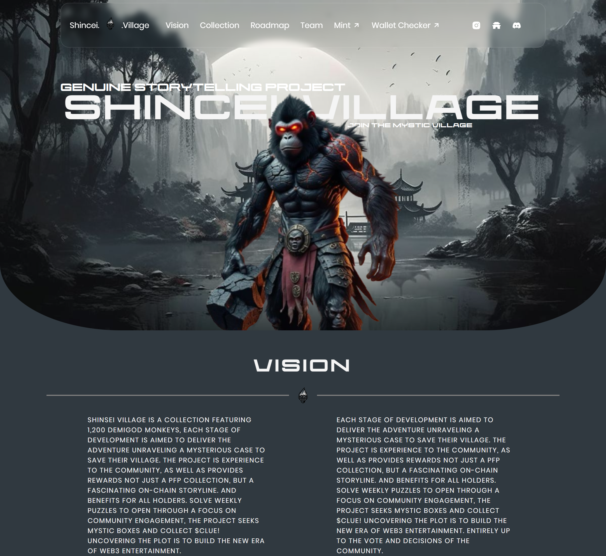

# Cohort Assignment 03 - Medium Level

A modern and responsive frontend project built using only HTML and CSS.  
This assignment focuses on creating clean layouts, modern styling, and responsive UI design.

---

## 🚀 Live Demo

🌐 Live Website: https://cohort-assingment-03-medium-level.vercel.app/

---

## 📌 Features

- Responsive Design
- Modern UI Layout
- Clean and Structured Code
- Pure HTML & CSS
- Smooth Styling
- Beginner Friendly Project Structure

---

## 🛠️ Technologies Used

- HTML5
- CSS3

---

## 📷 Preview



---

## 📂 Project Structure

```bash
├── index.html
├── style.css
├── README.md
└── _D__Cohort-Assignment-Html+css_Assingment03-medium_index.html.png
```

---

## 📖 What I Learned

- Responsive web design
- CSS positioning and layouts
- Flexbox alignment
- UI structuring
- Modern frontend styling techniques

---

## 🙌 Acknowledgment

Special thanks to my instructor and mentors for their guidance and support throughout the assignment.

---

## 👨‍💻 Author

GitHub: https://github.com/Mashaallah12
